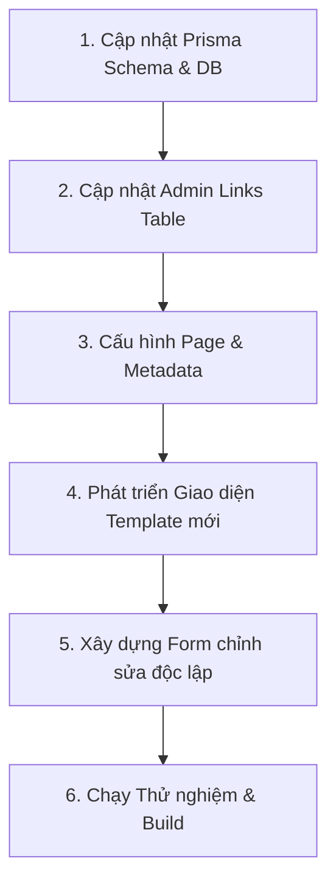

# Kế Hoạch Triển Khai Template Tốt Nghiệp (Graduation Templates Plan)

Tài liệu này trình bày chi tiết kế hoạch thêm 2 mẫu giao diện mới: **Tốt nghiệp cá nhân (`GRAD_PERSONAL`)** và **Tốt nghiệp tập thể (`GRAD_CLASS`)** vào dự án Love Memories, đảm bảo **không ảnh hưởng/gây lỗi** cho các mẫu hiện tại (`LOVE`, `IDOL`, `EVERY`).

---

## 🛡️ Nguyên Tắc An Toàn (Zero-Impact Principle)
1. **Cô lập code (Code Isolation):** Các trang giao diện và form chỉnh sửa mới sẽ được viết trong các component/tệp mới hoàn toàn (`GradPersonalTemplate.tsx`, `GradClassTemplate.tsx`, `EditGradProfileForm.tsx`).
2. **Khớp nối Enum (Enum Switch Exhaustiveness):** TypeScript yêu cầu xử lý đầy đủ các giá trị enum. Ta sẽ cập nhật tất cả các khối `switch-case` liên quan đến `LinkType` trên toàn hệ thống để tránh lỗi biên dịch.
3. **Mở rộng Database không hủy hoại:** Chỉ thêm phần tử mới vào enum trong Prisma mà không thay đổi cấu trúc bảng, đảm bảo dữ liệu cũ không bị biến đổi hay mất mát.

---

## 📋 Chi Tiết Các Bước Triển Khai



### Bước 1: Cập nhật Database Schema
*   **Tệp cần sửa:** [schema.prisma](file:///home/sontc/sources/love_memories/prisma/schema.prisma)
*   **Hành động:** Thêm `GRAD_PERSONAL` và `GRAD_CLASS` vào `enum LinkType`.
*   **Chạy lệnh:**
    ```bash
    npm run db:push
    ```
    *(Lệnh này chỉ bổ sung giá trị enum vào Postgres DB, hoàn toàn an toàn cho dữ liệu hiện tại).*

### Bước 2: Cập nhật Giao diện Admin quản lý liên kết
*   **Tệp cần sửa:** [links-table.tsx](file:///home/sontc/sources/love_memories/src/app/admin/links/links-table.tsx)
*   **Hành động:**
    *   Thêm cases cho `GRAD_PERSONAL` và `GRAD_CLASS` vào hàm `getTypeIcon` (sử dụng icon `GraduationCap` và `Users`).
    *   Thêm cases vào hàm `getTypeBadgeColor` để định nghĩa màu badge hiển thị.
    *   Thêm các `<SelectItem>` tương ứng vào thẻ `<Select name="linkType">` trong Dialog tạo liên kết để Admin có thể lựa chọn 2 loại mới này.

### Bước 3: Cấu hình Routing & Metadata cho trang hiển thị
*   **Tệp cần sửa:**
    1.  [page-client.tsx](file:///home/sontc/sources/love_memories/src/app/[slug]/page-client.tsx)
        *   Cập nhật `getWelcomeTitle()` để hiển thị tiêu đề chào mừng phù hợp.
        *   Cập nhật `getTheme()` để trả về các biến CSS tương ứng.
        *   Cập nhật `renderTemplate()` để map `GRAD_PERSONAL` sang `<GradPersonalTemplate>` và `GRAD_CLASS` sang `<GradClassTemplate>`.
    2.  [page.tsx](file:///home/sontc/sources/love_memories/src/app/[slug]/page.tsx)
        *   Cập nhật hàm sinh SEO `generateMetadata` để hiển thị tiêu đề và mô tả chính xác theo từng loại tốt nghiệp.

### Bước 4: Xây dựng Giao diện Template mới (Độc lập 100%)
*   **Tạo mới các tệp:**
    1.  `src/components/templates/GradPersonalTemplate.tsx` (Cho cá nhân)
    2.  `src/components/templates/GradClassTemplate.tsx` (Cho tập thể lớp)
*   **Nội dung:** Phát triển giao diện hoài niệm tuổi học trò, tích hợp đầy đủ hiệu ứng rơi lá phượng/bóng bay, bảng đen phấn trắng, danh sách thành viên lớp, và album ảnh kỷ yếu độc lập.

### Bước 5: Xây dựng Form chỉnh sửa dữ liệu Profile
*   **Tệp cần sửa:** [EditProfileForm.tsx](file:///home/sontc/sources/love_memories/src/components/edit/EditProfileForm.tsx)
*   **Hành động:**
    *   Tạo thêm các form chuyên biệt `GradPersonalProfileForm` và `GradClassProfileForm` để người dùng nhập thông tin tương ứng (slogan lớp, niên khóa, trường, GVCN, ước mơ...).
    *   Tích hợp xử lý trong `EditProfileForm` dựa trên `linkType`.

### Bước 6: Kiểm tra lỗi Lint và Build toàn dự án
*   **Chạy lệnh:**
    ```bash
    npm run build
    ```
    Để đảm bảo trình biên dịch Next.js và TypeScript không phát hiện bất kỳ lỗi kiểu dữ liệu (type check) nào.
